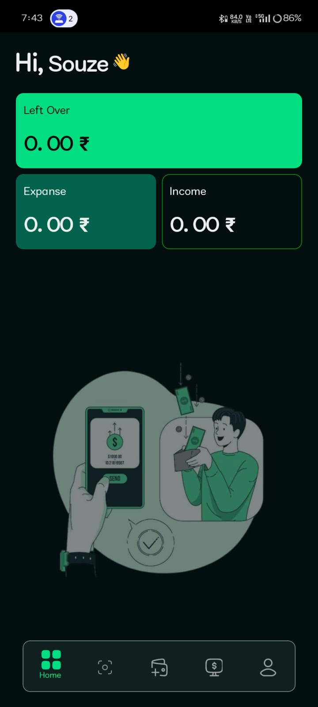
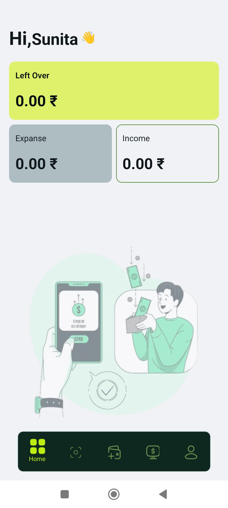
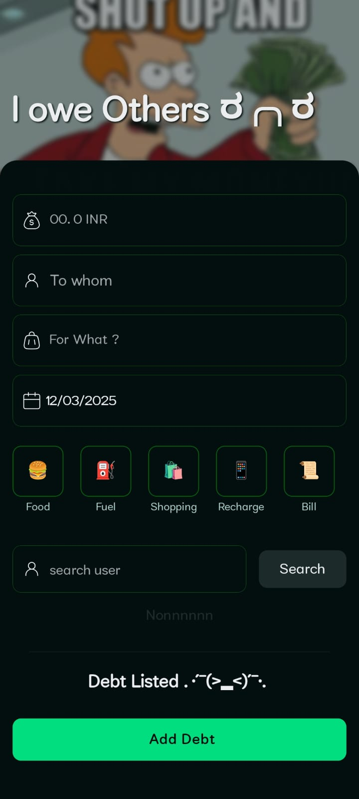
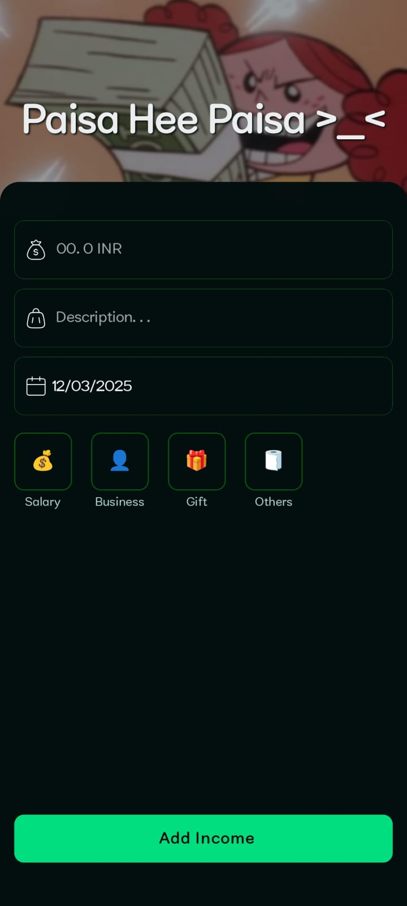
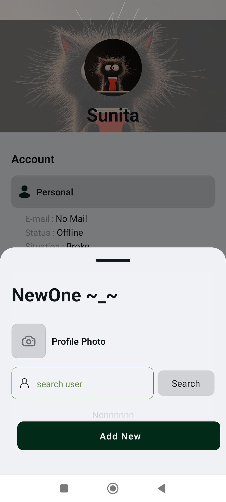
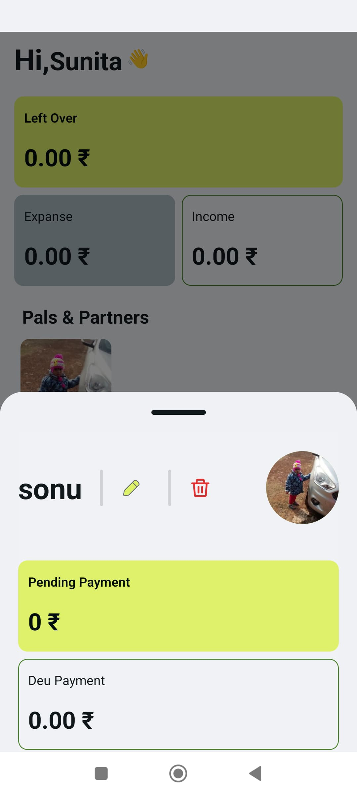
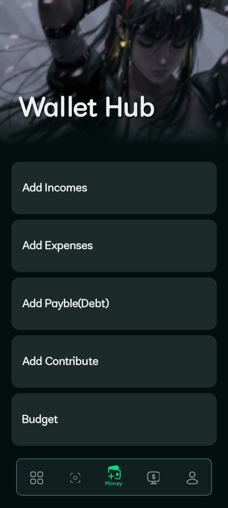

<div align="center" style="display: flex; align-items: center; justify-content: center;">
  
 <h1 >💰 MoneyManager App</h1>
</div>

<div align="center">


</div>

## 🚀 Overview

**MoneyManager** is a sleek and intuitive mobile app built with **React Native** and **Expo** to help you take control of your finances! Whether you're tracking daily expenses, managing your budget, or splitting costs with friends and family, MoneyManager makes it easy to keep your finances in check. 💸📊

## 🌟 Key Features

- **📱 Track Your Expenses**: Quickly add and categorize your expenses for easy management.
- **🤝 Split Costs**: Share the load with friends or family by splitting expenses automatically.
- **📈 Visual Reports**: Get insightful spending reports and charts to visualize your financial habits.
- **💵 Budget Management**: Set monthly or weekly budgets and monitor your progress to stay within your limits.
- **⚙️ Customizable Settings**: Adjust currency, notifications, and other preferences to suit your needs.
- **🖥️ User-Friendly Design**: Enjoy a clean, modern, and intuitive interface that makes finance management fun!

## 🛠️ Getting Started

### 🎯 Prerequisites

To run **MoneyManager** locally, you'll need the following:

- [Node.js](https://nodejs.org/) (version 14 or later)
- [Expo CLI](https://docs.expo.dev/get-started/installation/) (Install with `npm install -g expo-cli`) (Can go Without Downloading)
- A code editor like [Visual Studio Code](https://code.visualstudio.com/)

### 🏃‍♂️ Installation

1. **Clone the repository**:

   ```bash
   git clone https://github.com/SouZe-San/moneyManegar.git
   cd moneyManegar
   ```

2. **Install dependencies**:

   ```bash
   npm install
   ```

3. **Start the development server**:

   ```bash
    npx expo start
   ```

4. **Run the app**:
   - [development build](https://docs.expo.dev/develop/development-builds/introduction/)
   - [Android emulator](https://docs.expo.dev/workflow/android-studio-emulator/)
   - [iOS simulator](https://docs.expo.dev/workflow/ios-simulator/)
   - [Expo Go](https://expo.dev/go),Open the app on your mobile device using the **Expo Go** app or run it in an emulator.

> 🔑 **Tip**: You can scan the QR code with Expo Go for a quick preview of the app on your device!

## 💡 Usage

### How to Use the App:

- **👤 Create an Account or Log In**: Start by signing up or logging into your MoneyManager account.
- **💳 Add an Expense/Income**: Add new expenses or Income and categorize them for a better overview.
- **⚖️ Split Expenses**: Divide expenses between friends or family members.
- **⚖️ Create Groups**: DCreate a new group for shared expenses (e.g., roommates, family trips, etc.). Add members and start tracking group expenses!
- **📊 View Reports**: Head to the Analysis Section for insightful charts and data on your spending.
- **💡 Manage Budgets**: Set a budget for the month and track your progress to stay financially healthy.
- **⚙️ Customize Settings**: Personalize your app by adjusting settings like currency, notifications, and more!

## 📸 Screenshots

<div style="display: flex; align-items: center; justify-content: center; flex-wrap: wrap; gap:10px;">
   
   
</div>
<div style="display: flex; align-items: center; justify-content: center; flex-wrap: wrap; gap:10px; margin-top: 10px;">
   
   
</div>
<div style="display: flex; align-items: center; justify-content: center; flex-wrap: wrap; gap:10px; margin-top: 10px;">
   
   
</div>
<div style="display: flex; align-items: center; justify-content: center; flex-wrap: wrap; gap:10px; margin-top: 10px;">
   
</div>

## 🔐 Privacy Policy

Your privacy is our top priority. Please check out our <b>Privacy Policy</b> to learn more about how we handle your data.

## 📞 Support
